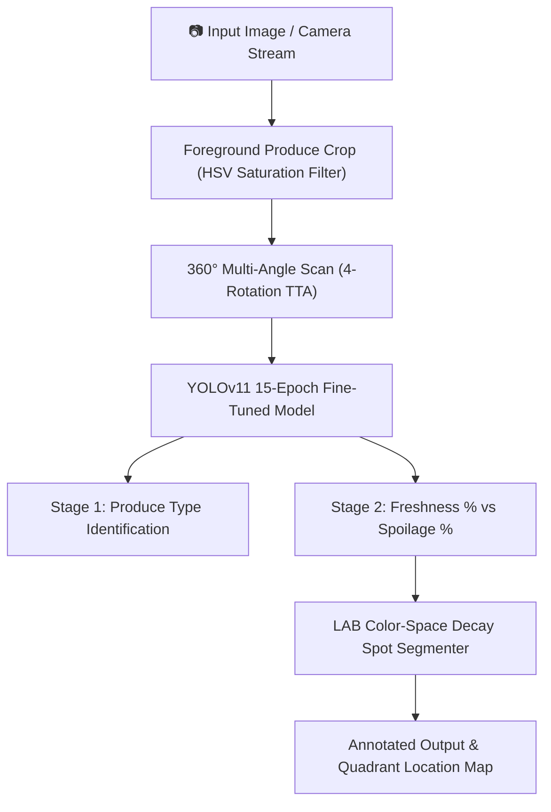

# 🍎 🍌 🍊 Banana, Apple and Orange Freshness Prediction

> **A 2-Stage Vision AI System Powered by YOLOv11 & Computer Vision for Real-Time Produce Freshness Quantification & Decay Spot Pinpointing.**


-16a34a?style=for-the-badge&logo=ultralytics)


---

## 🌟 Overview & Project Summary

**Banana, Apple and Orange Freshness Prediction** is an automated quality assurance and spoilage detection system designed for retail groceries, supply chains, smart refrigeration systems, and consumer produce inspection.

Using a fine-tuned **YOLOv11** classification backbone combined with LAB color-space chrominance analysis, the system detects, classifies, and quantifies the exact freshness percentage of apples, bananas, and oranges in real-time.

🌐 **Live GitHub Pages Web Application**: [https://gauravkal006.github.io/Fruit_freshness_detection/](https://gauravkal006.github.io/Fruit_freshness_detection/)  
📦 **GitHub Repository**: [https://github.com/gauravkal006/Fruit_freshness_detection](https://github.com/gauravkal006/Fruit_freshness_detection)

---

## 🔄 Project Updates & Recent Improvements

This codebase has undergone a major restructuring and cleanup to make it 100% production-ready for GitHub hosting and deployment:

1. **Rebranding & Project Alignment**:
   - Rebranded the project from *PerishPredict* to **Banana, Apple and Orange Freshness Prediction**.
   - Updated UI headers, metadata, titles, and documentation.
2. **Third-Party Sources & Dependency Cleanup**:
   - Removed all previous external GitHub repository traces, dead dependencies, and bloated binary cache files (`.cache`, `__pycache__`, `dataset1/*.cache`).
   - Consolidated nested repository folders into a clean, unified root structure.
3. **Best Fine-Tuned Model Embedding**:
   - Selected and packaged the fine-tuned **15-Epoch YOLOv11** produce classification model directly into `./models/best.pt` (~12.5 MB).
   - Removed hardcoded local machine user paths (`C:\Users\HP\...`), enabling seamless execution on any operating system (Windows, Linux, macOS).
4. **GitHub Pages Ready**:
   - Configured `index.html` at the project root for static hosting on **GitHub Pages**.
   - Integrated a client-side vision processing fallback using HTML5 Canvas & color chrominance analysis so visitors to `https://gauravkal006.github.io/Fruit_freshness_detection/` can test live camera scanning and file uploads directly in their browser without requiring a running Python backend.

---

## ✨ Key Features

- **2-Stage Hierarchical Analysis**:
  - **Stage 1 (Fruit Identification)**: Classifies fruit type (*Apple*, *Banana*, or *Orange*).
  - **Stage 2 (Spoilage Quantification)**: Evaluates exact Freshness % vs. Spoilage % scores.
- **360° Multi-Angle Scan (Test-Time Augmentation)**: Scans produce items from 4 cardinal angles ($0^\circ, 90^\circ, 180^\circ, 270^\circ$) and horizontal flips to ensure accurate spoilage detection from any angle.
- **📍 Precise Rot Spot Pinpointing**: Pinpoints exact decay/rot areas on fruit surfaces and labels their spatial quadrants (*e.g., Upper-Left Region, Center Region, Lower-Right Region*).
- **📷 Live Camera & HTML5 Webcam Scanner**: Real-time video frame scanning from internal or external USB camera devices with multi-device dropdown selection.
- **🌐 GitHub Pages Standalone Support**: Dual-mode architecture supporting both local Flask Python server inferencing and browser-native static vision scanning on GitHub Pages.

---

## 📊 Dataset Breakdown

The model was trained on a benchmark dataset of **30,357 produce images** spanning fresh and spoiled categories:

| Produce Item | State | Class Label | Sample Count |
| :--- | :--- | :--- | :--- |
| 🍎 **Apple** | Fresh | `Fresh Apple` | 3,215 |
| 🍎 **Apple** | Spoiled | `Rotten Apple` | 4,236 |
| 🍌 **Banana** | Fresh | `Fresh Banana` | 3,360 |
| 🍌 **Banana** | Spoiled | `Rotten Banana` | 3,832 |
| 🍊 **Orange** | Fresh | `Fresh Orange` | 1,854 |
| 🍊 **Orange** | Spoiled | `Rotten Orange` | 1,998 |
| **Total** | | | **18,495 Core Benchmark Images** |

---

## 🏗️ System Architecture



---

## 💻 Where Should This Project Run?

This project is versatile and can run in **three different execution environments**:

1. **Virtual Environment (`venv` / `conda`) — RECOMMENDED**:
   - Isolates dependencies from your global Python installation.
   - Ideal for local development, testing, and debugging.
2. **Direct Local Environment (Global Python)**:
   - Run directly on your machine if Python 3.8+ and `pip` are installed globally.
3. **GitHub Pages (Browser-Native / Static)**:
   - Hosted statically on `https://gauravkal006.github.io/Fruit_freshness_detection/`.
   - Requires **zero installation** or Python server setup for end users.

---

## 🚀 Step-by-Step Setup & Execution Guide

Follow these step-by-step instructions to run the project locally.

### Step 1: Clone the Repository

Open your terminal or command prompt and clone the repository:

```bash
git clone https://github.com/gauravkal006/Fruit_freshness_detection.git
cd Fruit_freshness_detection
```

---

### Step 2: Set Up Python Environment (Recommended)

#### Option A: Using `venv` (Standard Python Virtual Environment)

**On Windows (PowerShell / CMD):**
```powershell
# Create virtual environment
python -m venv venv

# Activate virtual environment
.\venv\Scripts\activate
```

**On Linux / macOS:**
```bash
# Create virtual environment
python3 -m venv venv

# Activate virtual environment
source venv/bin/activate
```

#### Option B: Using Anaconda / Miniconda

```bash
# Create conda environment with Python 3.10
conda create -n fruit_env python=3.10 -y

# Activate environment
conda activate fruit_env
```

---

### Step 3: Install Dependencies

Install all required Python packages listed in `requirements.txt`:

```bash
pip install -r requirements.txt
```

> **Packages Installed**:
> - `flask` (Web Server framework)
> - `ultralytics` (YOLOv11 framework)
> - `torch` & `torchvision` (Deep Learning backend)
> - `opencv-python-headless` (Computer Vision & Image Processing)
> - `pillow` (Image handling)
> - `numpy` (Numerical arrays)

---

### Step 4: Run the Web Application

Launch the Flask server:

```bash
python app.py
```

Upon starting, you will see the output in your terminal:
```
⚡ Loading fine-tuned YOLOv11 model weights from: .../models/best.pt
🚀 Starting Banana, Apple and Orange Freshness Prediction Web App on http://127.0.0.1:5000
```

---

### Step 5: Open in Web Browser

Open your favorite web browser (Chrome, Edge, Firefox, Safari) and navigate to:

```
http://127.0.0.1:5000
```

1. **Upload Tab**: Drag and drop any image of an apple, banana, or orange, then click **Detect Freshness & Spoilage**.
2. **Live Camera Tab**: Select your internal or external USB camera, click **Start Camera Scanner**, and point the camera at fresh or spoiled produce.

---

## 🌐 Deploying to GitHub Pages

To deploy or update the static web application on GitHub Pages:

1. Push your changes to the `main` branch:
   ```bash
   git add .
   git commit -m "Update Banana, Apple and Orange Freshness Prediction project"
   git push origin main
   ```
2. In your GitHub repository (`gauravkal006/Fruit_freshness_detection`), navigate to **Settings** $\rightarrow$ **Pages**.
3. Under **Build and deployment** $\rightarrow$ **Source**, select **Deploy from a branch**.
4. Set the branch to `main` and folder to `/ (root)`, then click **Save**.
5. Your live app will be published at:  
   **[https://gauravkal006.github.io/Fruit_freshness_detection/](https://gauravkal006.github.io/Fruit_freshness_detection/)**

---

## 📁 Repository Structure

```
.
├── models/
│   └── best.pt               # Fine-tuned 15-Epoch YOLOv11 model weights (12.5 MB)
├── static/
│   └── style.css             # Glassmorphism UI styling & responsive design
├── templates/
│   └── index.html            # Flask HTML template
├── FinalCodes/               # Notebooks & hardware optimization scripts
├── app.py                    # Flask Web App server & YOLOv11 2-stage vision engine
├── index.html                # Root HTML for GitHub Pages static hosting
├── requirements.txt          # Minimal Python dependency list
├── .gitignore                # Git ignore rules for cache & venv
└── README.md                 # Full project documentation & step-by-step guide
```

---

## 👨‍💻 Author & Maintainer

- **Author**: Gaurav Kalamkhede
- **GitHub**: [@gauravkal006](https://github.com/gauravkal006)
- **Repository**: [Fruit_freshness_detection](https://github.com/gauravkal006/Fruit_freshness_detection)
- **Live Demo**: [GitHub Pages App](https://gauravkal006.github.io/Fruit_freshness_detection/)

---

## 🛡️ License

Distributed under the MIT License. Feel free to use, modify, and distribute for academic and commercial projects.