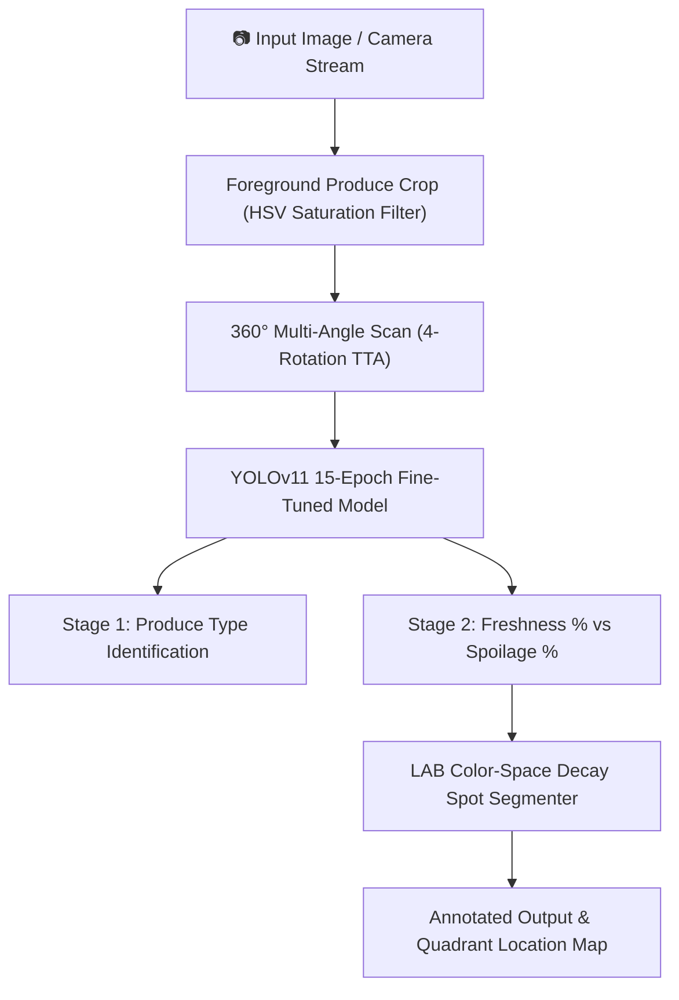

# 🍎 🍌 🍊 Banana, Apple and Orange Freshness Prediction

> **A 2-Stage Vision AI System Powered by YOLOv11 & Computer Vision for Real-Time Produce Freshness Quantification & Decay Spot Pinpointing.**


-16a34a?style=for-the-badge&logo=ultralytics)


---

## 🌟 Overview

**Banana, Apple and Orange Freshness Prediction** is an automated quality assurance and spoilage detection system designed for retail groceries, supply chains, smart refrigeration, and consumer produce inspection.

Using a fine-tuned **YOLOv11** classification backbone combined with LAB color-space chrominance analysis, the system detects, classifies, and quantifies the exact freshness percentage of apples, bananas, and oranges in real-time.

🌐 **Live GitHub Pages Web Application**: [https://gauravkal006.github.io/Fruit_freshness_detection/](https://gauravkal006.github.io/Fruit_freshness_detection/)  
📦 **GitHub Repository**: [https://github.com/gauravkal006/Fruit_freshness_detection](https://github.com/gauravkal006/Fruit_freshness_detection)

---

## ✨ Key Features

- **2-Stage Hierarchical Analysis**:
  - **Stage 1 (Fruit Identification)**: Classifies fruit type (*Apple*, *Banana*, or *Orange*).
  - **Stage 2 (Spoilage Quantification)**: Evaluates exact Freshness % vs. Spoilage % scores.
- **360° Multi-Angle Scan (Test-Time Augmentation)**: Scans produce items from 4 cardinal angles ($0^\circ, 90^\circ, 180^\circ, 270^\circ$) and horizontal flips to ensure accurate spoilage detection from any angle.
- **📍 Precise Rot Spot Pinpointing**: Pinpoints exact decay/rot areas on fruit surfaces and labels their spatial quadrants (*e.g., Upper-Left Region, Center Region, Lower-Right Region*).
- **📷 Live Camera & HTML5 Webcam Scanner**: Real-time video frame scanning from internal or external USB camera devices.
- **🌐 GitHub Pages Standalone Support**: Dual-mode architecture supporting both local Flask Python server inferencing and browser-native static vision scanning on GitHub Pages.

---

## 📊 Dataset Breakdown

The model was trained on a dataset of **30,357 balanced produce images** spanning fresh and spoiled categories:

| Produce Item | State | Class Label | Sample Count |
| :--- | :--- | :--- | :--- |
| 🍎 **Apple** | Fresh | `Fresh Apple` | 3,215 |
| 🍎 **Apple** | Spoiled | `Rotten Apple` | 4,236 |
| 🍌 **Banana** | Fresh | `Fresh Banana` | 3,360 |
| 🍌 **Banana** | Spoiled | `Rotten Banana` | 3,832 |
| 🍊 **Orange** | Fresh | `Fresh Orange` | 1,854 |
| 🍊 **Orange** | Spoiled | `Rotten Orange` | 1,998 |
| **Total** | | | **18,495 Core Benchmark Images** |

---

## 🏗️ System Architecture



---

## 🚀 Quick Start Guide

### 1. Prerequisites
- Python 3.8+
- PyTorch & torchvision
- Flask & OpenCV

### 2. Installation

Clone the repository and install requirements:

```bash
git clone https://github.com/gauravkal006/Fruit_freshness_detection.git
cd Fruit_freshness_detection
pip install -r requirements.txt
```

### 3. Running the Flask Server Locally

```bash
python app.py
```

Open your browser and navigate to:
```
http://127.0.0.1:5000
```

---

## 🌐 Deploying to GitHub Pages

To host the static client-side web application on GitHub Pages:

1. Push the code to the `main` branch of your GitHub repository `gauravkal006/Fruit_freshness_detection`.
2. Go to **Repository Settings** -> **Pages**.
3. Under **Build and deployment** -> **Source**, select **Deploy from a branch**.
4. Set the branch to `main` / `/ (root)` and click **Save**.
5. Your live app will be published at: `https://gauravkal006.github.io/Fruit_freshness_detection/`

---

## 📁 Repository Structure

```
.
├── models/
│   └── best.pt               # Fine-tuned 15-Epoch YOLOv11 model weights (12.5 MB)
├── static/
│   └── style.css             # UI design system & responsive layout
├── templates/
│   └── index.html            # Flask HTML template
├── FinalCodes/               # Notebooks & optimization utilities
├── app.py                    # Flask Web App backend
├── index.html                # Root HTML for GitHub Pages static hosting
├── requirements.txt          # Python dependencies
├── .gitignore                # Git ignore rules
└── README.md                 # Project documentation
```

---

## 🛡️ License

Distributed under the MIT License. See `LICENSE` for more information.
