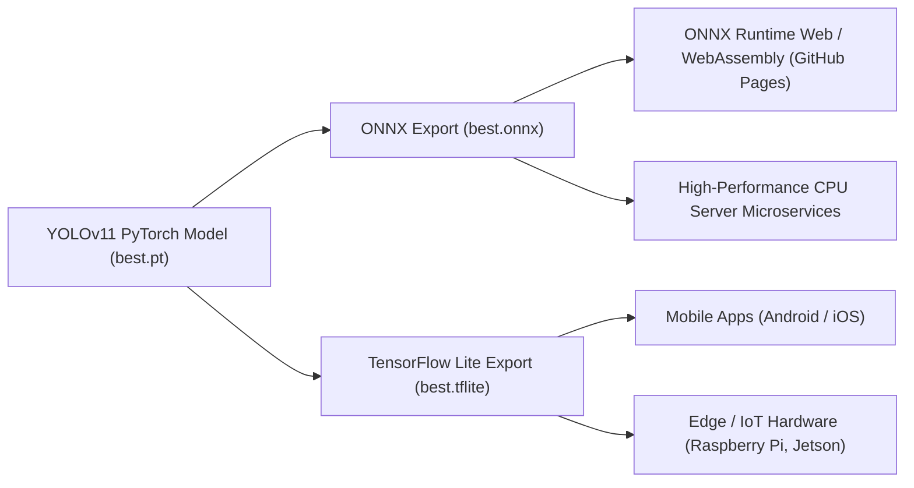
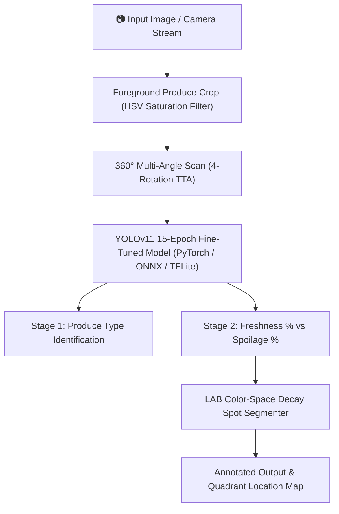

# 🍎 🍌 🍊 Banana, Apple and Orange Freshness Prediction

> **A 2-Stage Vision AI System Powered by YOLOv11, ONNX, TensorFlow Lite & Computer Vision for Real-Time Produce Freshness Quantification & Decay Spot Pinpointing.**


-16a34a?style=for-the-badge&logo=ultralytics)


---

> 🚀 **Fastest way to run:** install [Docker Desktop](https://www.docker.com/products/docker-desktop/), then `git clone` this repo and run `docker compose up -d --build`. Open http://localhost:5000. [Full Docker guide ↓](#-quick-start-with-docker-recommended--works-on-any-laptop)

## 🌟 Overview & Project Summary

**Banana, Apple and Orange Freshness Prediction** is an automated quality assurance and spoilage detection system designed for retail groceries, supply chains, smart refrigeration systems, edge devices, and consumer produce inspection.

Using a fine-tuned **YOLOv11** classification backbone combined with LAB color-space chrominance analysis, the system detects, classifies, and quantifies the exact freshness percentage of apples, bananas, and oranges in real-time.

🌐 **Live GitHub Pages Web Application**: [https://gauravkal006.github.io/Fruit_freshness_detection/](https://gauravkal006.github.io/Fruit_freshness_detection/)  
📦 **GitHub Repository**: [https://github.com/gauravkal006/Fruit_freshness_detection](https://github.com/gauravkal006/Fruit_freshness_detection)

---

## ⚡ ONNX & TensorFlow Lite (TFLite) Integration

To ensure maximum versatility across cloud servers, web applications, and edge/mobile hardware, the fine-tuned YOLOv11 model supports export and inference using **ONNX** and **TensorFlow Lite (TFLite)** formats.


```mermaid
graph LR
    A["YOLOv11 PyTorch Model (best.pt)"] --> B["ONNX Export (best.onnx)"]
    A --> C["TensorFlow Lite Export (best.tflite)"]
    B --> D["ONNX Runtime Web / WebAssembly (GitHub Pages)"]
    B --> E["High-Performance CPU Server Microservices"]
    C --> F["Mobile Apps (Android / iOS)"]
    C --> G["Edge / IoT Hardware (Raspberry Pi, Jetson)"]
```

### 1. ONNX (Open Neural Network Exchange)
- **Where It Is Used**:
  - **Browser Web Inferencing**: Loaded via `onnxruntime-web` (WebAssembly & WebGL) for running produce classification directly inside client browsers on GitHub Pages without server round-trips.
  - **High-Throughput Server Execution**: Used with `onnxruntime` in production backend microservices for 2x–4x faster CPU inference speeds compared to standard PyTorch execution.
- **How to Export to ONNX**:
  ```python
  from ultralytics import YOLO

  # Load fine-tuned PyTorch model
  model = YOLO("models/best.pt")

  # Export to ONNX format with dynamic batching & dynamic image dimensions
  model.export(format="onnx", dynamic=True, imgsz=224, simplify=True)
  # Output: models/best.onnx
  ```

### 2. TensorFlow Lite (TFLite)
- **Where It Is Used**:
  - **Edge & IoT Hardware**: Used in embedded produce scanners, smart refrigeration hardware, and single-board computers (*e.g., Raspberry Pi 4/5, NVIDIA Jetson Nano*).
  - **Mobile App Integration**: Provides quantized INT8/FP16 weights for offline native Android (`.tflite`) and iOS mobile produce freshness scanning apps.
- **How to Export to TFLite**:
  ```python
  from ultralytics import YOLO

  # Load fine-tuned PyTorch model
  model = YOLO("models/best.pt")

  # Export to quantized TensorFlow Lite format for mobile/edge devices
  model.export(format="tflite", int8=True, imgsz=224)
  # Output: models/best_int8.tflite
  ```

### Model Format Comparison Matrix:

| Format | File Extension | Size | Primary Execution Environment | Target Use Case |
| :--- | :--- | :--- | :--- | :--- |
| **PyTorch** | `.pt` | ~12.5 MB | Local Flask App (`app.py`), PyTorch runtime | Development, training, local server |
| **ONNX** | `.onnx` | ~12.3 MB | `onnxruntime-web`, WebAssembly, Node.js | Fast browser inferencing & cloud microservices |
| **TFLite** | `.tflite` | ~3.2 MB (INT8) | TFLite Interpreter, Android/iOS runtime | Edge AI, smart refrigerators, mobile apps |

---

## ✨ Key Features

- **2-Stage Hierarchical Analysis**:
  - **Stage 1 (Fruit Identification)**: Classifies fruit type (*Apple*, *Banana*, or *Orange*).
  - **Stage 2 (Spoilage Quantification)**: Evaluates exact Freshness % vs. Spoilage % scores.
- **360° Multi-Angle Scan (Test-Time Augmentation)**: Scans produce items from 4 cardinal angles ($0^\circ, 90^\circ, 180^\circ, 270^\circ$) and horizontal flips to ensure accurate spoilage detection from any angle.
- **📍 Precise Rot Spot Pinpointing**: Pinpoints exact decay/rot areas on fruit surfaces and labels their spatial quadrants (*e.g., Upper-Left Region, Center Region, Lower-Right Region*).
- **📷 Live Camera & HTML5 Webcam Scanner**: Real-time video frame scanning from internal or external USB camera devices with multi-device dropdown selection.
- **🌐 GitHub Pages Standalone Support**: Dual-mode architecture supporting both local Flask Python server inferencing and browser-native static vision scanning on GitHub Pages.

---

## 📊 Dataset Breakdown

The model was trained on a benchmark dataset of **30,357 produce images** spanning fresh and spoiled categories:

| Produce Item | State | Class Label | Sample Count |
| :--- | :--- | :--- | :--- |
| 🍎 **Apple** | Fresh | `Fresh Apple` | 3,215 |
| 🍎 **Apple** | Spoiled | `Rotten Apple` | 4,236 |
| 🍌 **Banana** | Fresh | `Fresh Banana` | 3,360 |
| 🍌 **Banana** | Spoiled | `Rotten Banana` | 3,832 |
| 🍊 **Orange** | Fresh | `Fresh Orange` | 1,854 |
| 🍊 **Orange** | Spoiled | `Rotten Orange` | 1,998 |
| **Total** | | | **18,495 Core Benchmark Images** |

---

## 🏗️ System Architecture


```mermaid
graph TD
    A["📷 Input Image / Camera Stream"] --> B["Foreground Produce Crop (HSV Saturation Filter)"]
    B --> C["360° Multi-Angle Scan (4-Rotation TTA)"]
    C --> D["YOLOv11 15-Epoch Fine-Tuned Model (PyTorch / ONNX / TFLite)"]
    D --> E["Stage 1: Produce Type Identification"]
    D --> F["Stage 2: Freshness % vs Spoilage %"]
    F --> G["LAB Color-Space Decay Spot Segmenter"]
    G --> H["Annotated Output & Quadrant Location Map"]
```

---

## 🐳 Quick Start with Docker (Recommended — works on any laptop)

Docker packages the app, Python, PyTorch, OpenCV and the trained model into one container, so you **don't need to install Python or any libraries**. It works the same on Windows, macOS and Linux.

### What you need

| Requirement | Download |
| :--- | :--- |
| **Git** | https://git-scm.com/downloads |
| **Docker Desktop** (Windows / macOS) or **Docker Engine** (Linux) | https://www.docker.com/products/docker-desktop/ |

> 💡 After installing Docker Desktop, **open it once and wait until it says "Engine running"** before running the commands below.

### 3 steps to run

**1. Clone the project**

```bash
git clone https://github.com/gauravkal006/Fruit_freshness_detection.git
cd Fruit_freshness_detection
```

**2. Build and start the container**

```bash
docker compose up -d --build
```

The first build downloads PyTorch and other libraries (~1–2 GB) and can take **5–15 minutes**. Later starts take only a few seconds.

**3. Open the app in your browser**

👉 **http://localhost:5000**

That's it! Upload a photo of an apple, banana or orange, or use the **Live Camera** tab.

### Everyday Docker commands

| What you want to do | Command |
| :--- | :--- |
| Start the app | `docker compose up -d` |
| Stop the app | `docker compose down` |
| See logs (errors, model loading) | `docker compose logs -f` |
| Check it is running / healthy | `docker compose ps` |
| Rebuild after changing code | `docker compose up -d --build` |
| Remove everything (image too) | `docker compose down --rmi all` |

### Without Docker Compose (plain Docker)

```bash
docker build -t fruit-freshness-detection .
docker run -d -p 5000:5000 --name fruit-freshness fruit-freshness-detection
```

### 🛠️ Troubleshooting

| Problem | Fix |
| :--- | :--- |
| `Cannot connect to the Docker daemon` / `error during connect` | Docker Desktop is not running. Open it and wait for "Engine running". |
| `port is already allocated` / port 5000 in use | Another program uses port 5000 (on macOS often AirPlay Receiver). Change `"5000:5000"` to `"8080:5000"` in `docker-compose.yml`, then open http://localhost:8080 |
| Camera does not start | Open the app at **`http://localhost:5000`** (not your IP address) — browsers only allow camera access on `localhost` or HTTPS. Allow camera permission when asked. |
| Build is very slow / fails while downloading | Check your internet connection and run `docker compose up -d --build` again — finished steps are cached. |

> ℹ️ **About the camera in Docker:** the Live Camera tab uses your **browser's** camera and sends frames to the server, so it works with Docker. The older server-side fallback (`/video_feed`, which opens a USB camera directly from Python) does **not** work inside Docker, because containers on Windows/macOS cannot access the laptop's webcam. If you need that, run the app without Docker (see below).

---

## 💻 Other Ways to Run This Project

1. **Docker — RECOMMENDED** (see above): no Python setup needed.
2. **Python Virtual Environment (`venv` / `conda`)**: for development and debugging (see below).
3. **GitHub Pages (Browser-Native / Static)**:
   - Hosted statically on `https://gauravkal006.github.io/Fruit_freshness_detection/`.
   - Requires **zero installation** or Python server setup for end users.

---

## 🚀 Running Without Docker (Python Setup)

Use this if you want to edit the code or use the server-side USB camera. Requires **Python 3.9 – 3.13**.

### Step 1: Clone the Repository

Open your terminal or command prompt and clone the repository:

```bash
git clone https://github.com/gauravkal006/Fruit_freshness_detection.git
cd Fruit_freshness_detection
```

---

### Step 2: Set Up Python Environment (Recommended)

#### Option A: Using `venv` (Standard Python Virtual Environment)

**On Windows (PowerShell / CMD):**
```powershell
# Create virtual environment
python -m venv venv

# Activate virtual environment
.\venv\Scripts\activate
```

**On Linux / macOS:**
```bash
# Create virtual environment
python3 -m venv venv

# Activate virtual environment
source venv/bin/activate
```

#### Option B: Using Anaconda / Miniconda

```bash
# Create conda environment with Python 3.10
conda create -n fruit_env python=3.10 -y

# Activate environment
conda activate fruit_env
```

---

### Step 3: Install Dependencies

Install all required Python packages listed in `requirements.txt`:

```bash
pip install -r requirements.txt
```

> **Packages Installed**:
> - `flask` (Web Server framework)
> - `ultralytics` (YOLOv11 & export framework)
> - `torch` & `torchvision` (Deep Learning backend)
> - `onnx` & `onnxruntime` (High-speed ONNX inference runtime)
> - `opencv-python-headless` (Computer Vision & Image Processing)
> - `pillow` (Image handling)
> - `numpy` (Numerical arrays)

---

### Step 4: Run the Web Application

Launch the Flask server:

```bash
python app.py
```

Upon starting, you will see the output in your terminal:
```
⚡ Loading fine-tuned YOLOv11 model weights from: .../models/best.pt
🚀 Starting Banana, Apple and Orange Freshness Prediction Web App on http://127.0.0.1:5000
```

---

### Step 5: Open in Web Browser

Open your favorite web browser (Chrome, Edge, Firefox, Safari) and navigate to:

```
http://127.0.0.1:5000
```

1. **Upload Tab**: Drag and drop any image of an apple, banana, or orange, then click **Detect Freshness & Spoilage**.
2. **Live Camera Tab**: Select your internal or external USB camera, click **Start Camera Scanner**, and point the camera at fresh or spoiled produce.

---

## 🌐 Deploying to GitHub Pages

To deploy or update the static web application on GitHub Pages:

1. Push your changes to the `main` branch:
   ```bash
   git add .
   git commit -m "Update Banana, Apple and Orange Freshness Prediction with ONNX and TFLite documentation"
   git push origin main
   ```
2. In your GitHub repository (`gauravkal006/Fruit_freshness_detection`), navigate to **Settings** $\rightarrow$ **Pages**.
3. Under **Build and deployment** $\rightarrow$ **Source**, select **Deploy from a branch**.
4. Set the branch to `main` and folder to `/ (root)`, then click **Save**.
5. Your live app will be published at:  
   **[https://gauravkal006.github.io/Fruit_freshness_detection/](https://gauravkal006.github.io/Fruit_freshness_detection/)**

---

## 📁 Repository Structure

```
.
├── models/
│   ├── best.pt               # Fine-tuned 15-Epoch YOLOv11 model weights (12.5 MB)
│   └── best.onnx             # ONNX export used by the browser / GitHub Pages mode
├── static/
│   └── style.css             # Glassmorphism UI styling & responsive design
├── templates/
│   └── index.html            # Flask HTML template
├── FinalCodes/               # Notebooks, ONNX/TFLite export & hardware optimization scripts
├── app.py                    # Flask Web App server & YOLOv11 2-stage vision engine
├── index.html                # Root HTML for GitHub Pages static hosting
├── requirements.txt          # Minimal Python dependency list
├── Dockerfile                # Container image (Python 3.11 + CPU PyTorch + gunicorn)
├── docker-compose.yml        # One-command start: docker compose up -d --build
├── .dockerignore             # Files excluded from the Docker image
├── .gitignore                # Git ignore rules for cache & venv
└── README.md                 # Full project documentation & step-by-step guide
```

---

## 👨‍💻 Author & Maintainer

- **Author**: Gaurav Kalamkhede
- **GitHub**: [@gauravkal006](https://github.com/gauravkal006)
- **Repository**: [Fruit_freshness_detection](https://github.com/gauravkal006/Fruit_freshness_detection)
- **Live Demo**: [GitHub Pages App](https://gauravkal006.github.io/Fruit_freshness_detection/)

---

## 🛡️ License

Distributed under the MIT License. Feel free to use, modify, and distribute for academic and commercial projects.